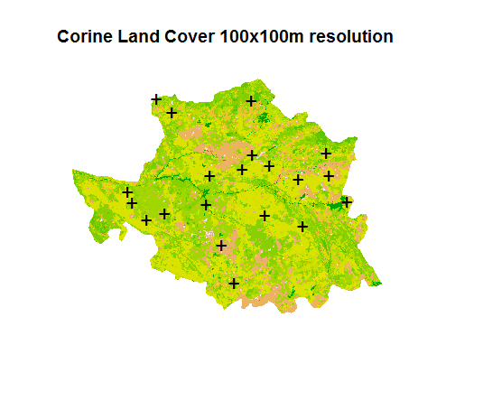

# gistools
*Adhara Pardo* (adharapv@gmail.com) 

An R package for analysing spatial ecological data. This package is meant to provide a collection of self-written functions for spatial data processing.

The package can be installed by typing:

```r
# the devtools package is needed to be able to load the package
# install.packages("devtools")
library(devtools)
install_github("adarapv/gistools")
library(gistools)
``` 
# Example usage
What follows is some simple examples of how this package can be used to handle spatial data and calculate a variety of landscape metrics. All the examples below make use
of the Corine Land Cover dataset (Bossard et al., 2000). 

## Required Packages

```{r packages, message=FALSE}
library(raster);library(rgeos)
library(SDMTools)
```


## Calculate landscape metrics around buffers of a given size
The function `buffercreate()` create buffers of given size around a set of sites and calculates a series of landscape metrics as implemented in fragstats (McGarigal & Marks, 1995). 

Example using the Corine Land Cover data (Bossard et al., 2000) for the province of Caceres (Spain):

```r
#' Create buffers and extract a series of landscape metrics
#' Input is a raster and a matrix of with site coordinates
#' @inrast = input raster
#' @inpoint = column containing species names 
#' @bufsize = buffer radius size
#' @rastcell= cell size of the raster


# Plot Corine Land Cover for the province of Caceres
plot(corine,legend=FALSE,box=FALSE,axes=FALSE,main="Corine Land Cover 100x100m resolution")

# Display 20 random sites
points(sites[,1],sites[,2],col="black",pch="+",cex=1.5)

```


```r

# Calculate landscape metrics for a sample of 20 sites (buffer size 5km)
buffresults<-buffercreate(inrast=corine,inpoint=sites,bufsize=5000,rastcell=100)

... Calculating buffer for site 1  ...
... Calculating buffer for site 2  ...
... Calculating buffer for site 3  ...
... Calculating buffer for site 4  ...
... Calculating buffer for site 5  ...
... Calculating buffer for site 6  ...

# Examine results for first 8 columns
head(buffresults)[1:8]
        x       y class n.patches total.area prop.landscape patch.density total.edge
1 2860658 2001861    18         1      10000   0.0001296849  1.296849e-08        400
2 2860658 2001861    22         9   39000000   0.5057709765  1.167164e-07      85000
3 2860658 2001861    23         1    2250000   0.0291790948  1.296849e-08      18200
4 2860658 2001861    26         9    6450000   0.0836467384  1.167164e-07      50800
5 2860658 2001861    28         3   28510000   0.3697315523  3.890546e-08      88000
6 2860658 2001861    29         1     280000   0.0036311762  1.296849e-08       4800
```

References

Bossard, M., Feranec, J., & Otahel, J. (2000). CORINE land cover technical guide: Addendum 2000.

McGarigal, K., & Marks, B. J. (1995). FRAGSTATS: spatial pattern analysis program for quantifying landscape structure.

