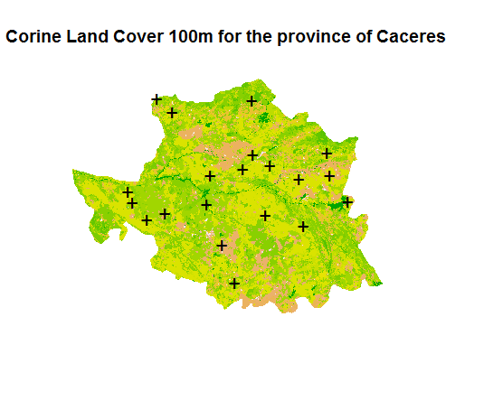

# gistools
*Adhara Pardo* (adharapv@gmail.com) 

An R package for analysing species diversity patterns along elevational gradients. This package is meant to provide a collection of self-written functions for the analyses of elevational diversity patterns.

The package can be installed by typing:

```r
# the devtools package is needed to be able to load the package
# install.packages("devtools")
library(devtools)
install_github("adarapv/gistools")
library(gistools)
``` 
# Example usage
What follows is some simple examples of how this package can be used to analyse spatial landscape and biodiversity data. All the examples below make use
of the publicly available dataset published in John T. Longino and Robert K. Colwell. 2011. Density compensation, species composition, and richness of ants on a neotropical elevational gradient. Ecosphere 2:art29.

## Required Packages

```{r packages, message=FALSE}
library(raster);library(rgeos)
library(SDMTools)
```


## Calculate landscape metrics around buffers of a given size
The function `buffercreate()` `betabas()` calculates buffers for sites, matrix corine dataset (reference), landscape metrics fragstats (reference). 

Example using the corine data for the province of Caceres (Spain):

```r
#' Partition beta diversity into richhness and replacement components (Carvalho et al. 2012)
#'@indat=name of dataframe containing species incidence data 
#'@alt=character vector indicating column name for altitude values
#'@group=character vector indicating column name for elevational gradient IDs 
#'(if there is more than one study area)


# Plot Corine Land Cover for the province of Caceres
plot(corine,legend=FALSE,box=FALSE,axes=FALSE,main="Corine Land Cover 100-province of Caceres")

# Display 20 random sites
points(sites[,1],sites[,2],col="black",pch="+",cex=1.5)
points(sites[,1],sites[,2],col="black",pch=16,cex=1.5)

```


```r
buffresults<-buffercreate(inrast=corine,inpoint=sites,bufsize=5000,rastcell=100)

head(buffresults)

```

References

Baselga, A. (2010) Partitioning the turnover and nestedness components of beta diversity. 
Global Ecology and Biogeography, 19, 134143.

